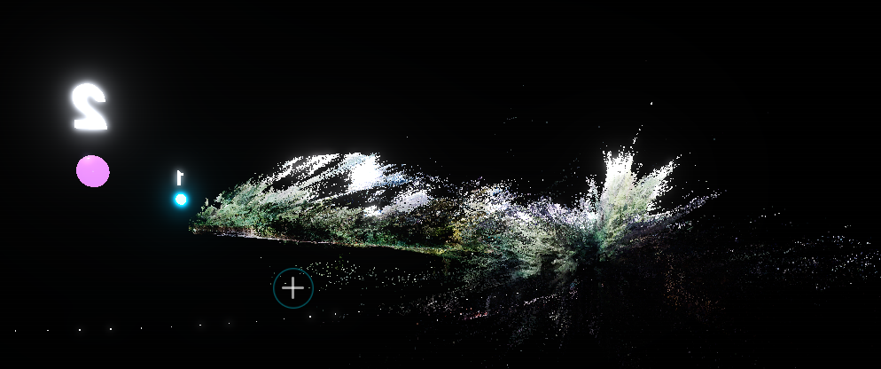

# 🌟 Jibin Jose | 3D Portfolio

An immersive, interactive 3D portfolio experience built with Three.js and Vite. Explore my skills, experience, and projects in a beautifully rendered 3D forest environment.

---

## 🚀 Experience the Journey

This isn't just a static resume—it's a playable environment. Walk through a dense forest, discover points of interest, and interact with markers to reveal my professional story.

### ✨ Key Features
- **Walking Simulator**: Move using `W A S D` and explore the world.
- **Cinematic Experience**: Switch to cinema mode with `C` or scan the environment with `V`.
- **Dynamic Weather**: Toggle rain effects with `R` for an atmospheric feel.
- **Interactive Points**: 9 unique locations representing different milestones and skills.
- **HUD & Compass**: Stay oriented with a functional HUD and mini-map.
- **Responsive & Premium UI**: Custom-built interfaces with Inter and Space Grotesk typography.

---

## 📸 Project Gallery

<p align="center">
  
  
  <br />
  
  
  <br />
  
  
  <br />
  
</p>

---

## 🛠️ Built With

- **Three.js**: For the core 3D engine and rendering.
- **Vite**: Modern frontend tooling for fast development and builds.
- **GSAP**: For smooth animations and cinematic transitions.
- **Vanilla CSS & JS**: Maximum performance and custom control.
- **Google Fonts**: Inter & Space Grotesk for a modern look.

---

## 🛠️ Local Development

### Prerequisites
- [Node.js](https://nodejs.org/) (Latest LTS)
- NPM or Yarn

### Installation

1. **Clone the repository:**
   ```bash
   git clone https://github.com/jibin7jose/3d-game-portfolio.git
   cd 3d-game-portfolio
   ```

2. **Install dependencies:**
   ```bash
   npm install
   ```

3. **Run development server:**
   ```bash
   npm run dev
   ```

4. **Build for production:**
   ```bash
   npm run build
   ```

---

## ⌨️ Controls

| Key | Action |
|-----|--------|
| **W A S D** | Move Character |
| **SHIFT** | Sprint |
| **Mouse** | Look Around |
| **E** | Interact |
| **V** | Scan Mode |
| **C** | Cinema View |
| **R** | Toggle Rain |

---

## 📂 Project Structure

- `index.html`: Main entry point.
- `main.js`: Core 3D logic and world building.
- `style.css`: UI and layout styling.
- `resume_data.js`: Data for the interactive points.
- `public/`: Assets including the 3D forest model and screenshots.

---

## 👤 Author

**Jibin Jose**  
Software Engineer & Frontend Developer

--

*Check out the live version on [Vercel](https://your-deployment-link.vercel.app) (if applicable)*
